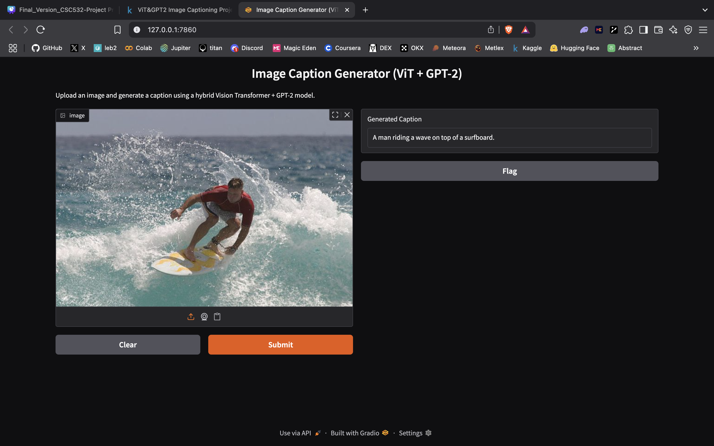

# Vision-GPT2-Captioner

Vision-GPT2-Captioner is an image captioning application that combines a Vision Transformer (ViT) with GPT-2 to generate captions for uploaded images. The model leverages the strengths of both vision and language models to produce descriptive captions.

## Features

- **Hybrid Model**: Combines Vision Transformer (ViT) for image feature extraction and GPT-2 for language modeling.
- **Interactive Interface**: Uses Gradio to provide a user-friendly web interface for uploading images and generating captions.
- **Pretrained Components**: Utilizes pretrained GPT-2 weights for efficient language generation.

## Installation

1. Clone the repository:
   ```bash
   git clone https://github.com/thompson129/image-captioning-project.git
   cd image-captioning-project
   ```

2. Install the required dependencies:
   ```bash
   pip install -r requirements.txt
   ```

3. Download Pretrained Model

   The pretrained model weights (`captioner.pt`) are required to run the application. You can download the file from the [Releases](https://github.com/thompson129/image-captioning-project/releases) section of this repository.

   After downloading, place the `captioner.pt` file in the root directory of the project (same directory as `app.py`).
   
## Usage

1. Run the application:
   ```bash
   python app.py
   ```

2. Open the Gradio interface in your browser (the link will be displayed in the terminal).

3. Upload an image and view the generated caption.

## File Structure

- `app.py`: Main application file that sets up the Gradio interface and handles image caption generation.
- `model.py`: Defines the Vision-GPT2 model architecture.
- `config.py`: Contains the configuration for the model (e.g., embedding dimensions, number of heads, etc.).
- `requirements.txt`: Lists the Python dependencies required for the project.
- `captioner.pt`: Pretrained model weights (not included in the repository; must be downloaded separately).

## Model Architecture

The model consists of:
- **Vision Transformer (ViT)**: Extracts image features and encodes them into a sequence of embeddings.
- **GPT-2**: Processes the embeddings and generates captions in natural language.

## Example


## Requirements

- Python 3.8+
- PyTorch
- timm
- transformers
- gradio
- numpy
- pillow

## Acknowledgments

- [Hugging Face Transformers](https://github.com/huggingface/transformers) for GPT-2.
- [PyTorch Image Models (timm)](https://github.com/rwightman/pytorch-image-models) for Vision Transformer.

